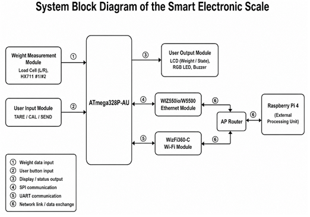

# Smart Scale Embedded System

듀얼 로드셀 기반의 무게 측정 기능과 Ethernet/Wi-Fi 통신 기능을 구현한
ATmega328P-AU 기반 스마트 전자저울입니다.

직접 Custom PCB를 설계 및 제작하였으며,
로드셀 계측, LCD UI, 버튼 입력, 유·무선 통신 및 외부 처리 장치와의 연동을 구현했습니다.

## Key Features

- ATmega328P-AU 기반 Custom PCB 설계 및 제작
- Dual Load Cell + Dual HX711 기반 무게 측정
- Tare / Calibration / Auto Zero 기능 구현
- 16×2 I2C LCD 사용자 인터페이스
- W5500 기반 Ethernet 통신
- WizFi360-C 기반 Wi-Fi 통신
- Ethernet 응답 실패 시 Wi-Fi 재전송
- Raspberry Pi 기반 외부 처리 시스템 연동
프로젝트 소개

## Tech Stack

| Category | Technology |
|---|---|
| MCU | ATmega328P-AU |
| Development | C/C++, PlatformIO, VS Code |
| Weight Sensor | Dual Load Cell, HX711 ×2 |
| Display | 16×2 I2C LCD |
| Wired Communication | W5500 Ethernet |
| Wireless Communication | WizFi360-C Wi-Fi |
| Interface | SPI, UART, I2C, GPIO |
| PCB | Custom 2-Layer PCB |
| External System | Raspberry Pi 4 |

---

## Demo Videos

### Custom PCB Bring-up & Hardware Verification

Custom PCB 제작 후 주요 하드웨어 기능을 단계별로 검증했습니다.

- Dual HX711 / Load Cell 동작 확인
- LCD / RGB LED / Button / Buzzer 확인
- 실제 하중 측정
- Ethernet / Wi-Fi 통신 모듈 확인

▶ [Watch PCB Bring-up Test](YOUTUBE_URL_1)

### Full System Demo

무게 측정부터 데이터 전송 및 분석 결과 수신까지 전체 시스템 동작을 검증했습니다.

- Weight Measurement
- Tare / Auto Zero
- Ethernet Communication
- Wi-Fi Retry
- Result Display

▶ [Watch Full System Demo](YOUTUBE_URL_2)

---

## System Architecture

스마트 전자저울은 Dual Load Cell을 통해 측정한 무게를
ATmega328P-AU에서 처리합니다.

외부 처리 장치와의 통신에는 W5500 기반 Ethernet과
WizFi360-C 기반 Wi-Fi를 사용하며, 동일한 AP Router를 통해
Raspberry Pi와 데이터를 송수신하도록 구성했습니다.

---

## Hardware

본 시스템의 주요 하드웨어는 다음과 같이 구성됩니다.

| Component | Function |
|---|---|
| ATmega328P-AU | Main MCU |
| Load Cell ×2 | Weight measurement |
| HX711 ×2 | Load-cell signal amplification and ADC |
| W5500 | Ethernet communication |
| WizFi360-C | Wi-Fi communication |
| 16×2 LCD | Weight and system status display |
| RGB LED | Operation status indication |
| Buzzer | User feedback |
| TARE / CAL / SEND Buttons | User input |

---

## Custom PCB

기존 모듈 기반 프로토타입 검증 후,
ATmega328P-AU를 중심으로 전자저울 기능을 하나의 Main PCB에 통합했습니다.

PCB에는 다음 기능을 구성했습니다.

- ATmega328P-AU MCU
- Dual HX711 load-cell interface
- W5500 Ethernet interface
- WizFi360-C Wi-Fi interface
- LCD / Button / RGB LED / Buzzer interface
- 5 V / 3.3 V power distribution

그 아래:

### PCB Layout

### Assembled PCB

---

## Firmware

Firmware는 기능별 모듈로 분리하여 구성했습니다.

| Module | Function |
|---|---|
| `Dual_Scale.h` | Dual Load Cell 측정 |
| `Calib.h` | Calibration |
| `Tare.h` | Tare 처리 |
| `AutoZero.h` | Auto Zero |
| `LCD.h` | LCD 출력 |
| `Button.h` | 사용자 입력 |
| `Wiz550.h` | Ethernet 통신 |
| `Wizfi360.h` | Wi-Fi 통신 |
| `MeatAnalysis.h` | 외부 분석 요청/결과 처리 |

---

## Weight Measurement

두 개의 로드셀과 HX711을 독립적으로 읽은 후
각 센서의 보정 계수를 적용하여 최종 무게를 계산합니다.

주요 기능은 다음과 같습니다.

- Dual Load Cell measurement
- Individual calibration factor
- Tare
- Auto Zero
- Stable weight display

---

## Ethernet / Wi-Fi Communication
외부 처리 장치와의 통신을 위해 두 개의 통신 경로를 구성했습니다.

### Ethernet

ATmega328P-AU와 W5500을 SPI로 연결하고,
Ethernet을 기본 통신 경로로 사용했습니다.

### Wi-Fi

WizFi360-C는 UART를 통해 MCU와 연결하였으며,
Ethernet 응답이 정상적으로 수신되지 않는 경우
Wi-Fi 경로를 이용해 동일한 요청을 다시 전송하도록 구성했습니다.

---

## Troubleshooting

**Problem**

좌·우 로드셀 측정값의 편차로 인해 전체 무게값이 안정적으로 유지되지 않는 문제가 발생했습니다.

**Cause**

두 로드셀의 감도 차이와 개별 보정 계수 차이를 확인했습니다.

**Solution**

각 로드셀에 독립적인 보정 계수를 적용한 뒤
두 측정값을 합산하도록 펌웨어를 수정했습니다.

**Result**

좌·우 센서 특성을 개별 보정하여 최종 무게 측정값을 안정화했습니다.

---

## Results

- Custom PCB 제작 및 Hardware Bring-up 완료
- Dual Load Cell 기반 무게 측정 동작 확인
- Tare / Calibration / Auto Zero 구현
- Ethernet 및 Wi-Fi 통신 확인
- Ethernet 실패 시 Wi-Fi 재전송 동작 확인
- Raspberry Pi 외부 처리 시스템과 통합 동작 확인
