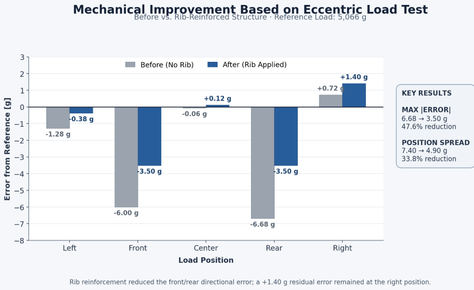

# Smart Scale Embedded System

ATmega328P-AU 기반 Custom PCB와 Dual Load Cell을 이용하여  
무게 측정, 사용자 인터페이스, Ethernet/Wi-Fi 통신을 구현한 스마트 전자저울 프로젝트입니다.

Prototype 단계에서 계량 구조를 먼저 검증한 뒤,  
ATmega328P-AU와 Dual HX711 회로를 적용한 2-Layer Main PCB를 직접 설계·제작하고  
Firmware, Board Bring-up, 계량 실험 및 Raspberry Pi 외부 시스템 연동까지 진행했습니다.

---

## Portfolio

[📄 Embedded HW/FW Portfolio (PDF)](docs/portfolio/Portfolio.pdf)

---

## 1. Project Overview & My Contribution

본 프로젝트는 스마트 전자저울과 Raspberry Pi 기반 육류 품질 판별 시스템을 연동한 2인 팀 프로젝트입니다.

### My Scope — Embedded HW / FW

- ATmega328P-AU 기반 2-Layer Main PCB 회로 설계 및 PCB Layout
- 10 kg Load Cell ×2 + HX711 IC ×2 측정 회로 구성
- Tare / Calibration / AutoZero 및 좌·우 독립 보정 Firmware
- LCD / Button / RGB LED / Buzzer 제어
- WIZ550io Ethernet 및 WizFi360io-C Wi-Fi 통신 구현
- Ethernet 응답 실패 시 Wi-Fi 재전송 로직 구현
- PCB Bring-up, 계량 시험, 3D 프린팅 기구 제작 및 시스템 조립

### Teammate Scope

- UVC Camera
- Raspberry Pi 4
- AI 기반 육류 품질 판별

### Main Components

| Category | Component |
|---|---|
| MCU | ATmega328P-AU |
| Weight Sensor | 10 kg Load Cell ×2 |
| ADC | HX711 IC ×2 |
| Ethernet | WIZ550io(W5500) |
| Wi-Fi | WizFi360io-C |
| UI | LCD ×2, Button, RGB LED, Buzzer |
| External Processing | Raspberry Pi 4 |

---

## 2. System Architecture

Dual Load Cell의 신호는 각각의 HX711을 통해 ATmega328P-AU로 입력됩니다.

MCU에서는 좌·우 채널을 독립적으로 보정한 뒤 최종 무게를 계산하며,
LCD와 사용자 입력 장치를 제어합니다.

외부 시스템과의 통신은 두 경로로 구성했습니다.

- **SPI → WIZ550io → Ethernet**
- **UART → WizFi360io-C → Wi-Fi**

사용자가 SEND 버튼을 누르면 현재 무게값을 Raspberry Pi 4로 전달하고,
수신한 분석 결과를 LCD에 표시합니다.

---

## 3. Hardware Development

### Prototype → Final Custom PCB

최종 PCB를 바로 제작하지 않고,
ATmega128A와 상용 HX711 모듈을 이용해 Dual Load Cell 측정 구조를 먼저 검증했습니다.

Prototype에서 검증한 구조를 바탕으로  
최종 시스템에서는 ATmega328P-AU와 두 개의 HX711 IC를 하나의 Main PCB에 통합했습니다.

| Prototype | Final Custom PCB |
|---|---|
| ATmega128A | ATmega328P-AU |
| HX711 Module ×2 | HX711 IC ×2 Direct Integration |
| Breadboard / Jumper Wiring | 2-Layer Custom PCB |
| Measurement Structure Validation | Final Hardware Integration |

최종 PCB에서는 상용 HX711 모듈을 사용하지 않고
HX711 SOP-16 IC와 주변회로를 직접 구성했습니다.

Detailed schematics: [`hardware/schematic`](hardware/schematic)

> Prototype 결과는 측정 구조와 시험 방법을 검토하기 위한 개발 단계 자료이며,
> 최종 성능 결과는 Rib가 적용된 최종 기구 구조에서 수행한 Validation 결과를 기준으로 제시합니다.

---

## 4. Firmware & Communication

Firmware는 센서 측정, 보정, 사용자 인터페이스 및 통신 기능을 분리하여 구성했습니다.

| Module | Function |
|---|---|
| `Dual_Scale.h`, `Calib.h` | Dual Load Cell 측정 및 Calibration |
| `Tare.h`, `AutoZero.h` | Tare / AutoZero |
| `LCD.h`, `Button.h` | User Interface |
| `Wiz550.h` | Ethernet |
| `Wizfi360.h` | Wi-Fi |
| `MeatAnalysis.h` | Request / Response 처리 |

두 HX711에서 좌·우 Raw 값을 독립적으로 읽은 뒤
각 채널의 Calibration Factor를 적용하여 무게값을 계산합니다.

### Ethernet / Wi-Fi Fallback

SEND 입력이 발생하면 Ethernet을 우선 사용합니다.

Ethernet 경로에서 응답을 받지 못하면
시스템 초기화 단계에서 AP Router에 접속해 둔 WizFi360io-C를 이용하여
동일한 요청을 Wi-Fi로 다시 전송합니다.

| Type | Data Format | Processing |
|---|---|---|
| Request | `CAPTURE,W=<weight>` | 현재 무게와 분석 요청 전송 |
| Ethernet Response | `G`, `M`, `C` payload | 결과 파싱 후 LCD 표시 |
| Wi-Fi Response | `+IPD,<len>:<payload>` | `+IPD` 헤더 제거 후 payload 파싱 |

---

## 5. Board Bring-up

Main PCB 제작 후 모든 기능을 한 번에 연결하지 않고
전원부부터 센서, UI, 통신 순서로 단계별 검증을 수행했습니다.

| Step | Verification |
|---|---|
| 1 | VCC-GND Short Check |
| 2 | 5 V / 3.3 V Power Rail |
| 3 | MCU Firmware / GPIO |
| 4 | HX711 #L / #R Raw Response |
| 5 | LCD / Button / RGB LED / Buzzer |
| 6 | Tare / Calibration |
| 7 | WIZ550io SPI / Link / IP |
| 8 | WizFi360io-C AT / AP / IP |

Custom PCB에서 좌·우 HX711의 Raw 데이터가
각 Load Cell의 하중 변화에 따라 독립적으로 반응하는 것을 확인했습니다.

### PCB Bring-up Video

---

## 6. Measurement Validation

최종 PCB와 기구물을 결합한 상태에서 계량 특성을 검증했습니다.
초기 편하중 시험에서 Front / Rear 방향의 오차를 확인하여
상판 지지 구조에 Rib를 추가한 뒤 동일 조건으로 재시험했습니다.

### Key Results

| Test | Result |
|---|---|
| Mechanical Improvement | Max |Error|: **6.68 → 3.50 g** |
| Position Spread | **7.40 → 4.90 g** |
| Load Accuracy | Max mean error **7.14 g** |
| Repeatability | Range **0.60 g**, SD **0.17 g**, n=10 |
| 30-min Hold | Max Δ **0.50 g**, 30 min Δ **−0.10 g** |
| Zero Return | **−0.50 ~ +0.40 g**, n=10 |

Rib 적용 후 최종 구조를 기준으로
Load Accuracy, Repeatability, 30-min Hold, Zero Return을 다시 측정했습니다.

- [Load Accuracy](docs/validation/final_pcb/final_rib/load_error_result.png)
- [Repeatability](docs/validation/final_pcb/final_rib/repeatability_result.png)
- [30-min Hold](docs/validation/final_pcb/final_rib/constant_load_result.png)
- [Zero Return](docs/validation/final_pcb/final_rib/zero_return_result.png)

> 시험 항목은 OIML R 76의 평가 개념을 참고했으며,
> 정식 인증 또는 적합성 시험을 의미하지 않습니다.

---

## 7. Engineering Decisions & Troubleshooting

### Dual Load Cell Calibration

좌·우 Load Cell의 Raw 값과 감도 차이를 확인하여
각 채널에 독립적인 Offset과 Calibration Factor를 적용했습니다.
보정된 좌·우 무게값을 합산하여 최종 측정값을 계산하도록 Firmware를 구성했습니다.

### Communication Fallback

Ethernet을 Primary 통신으로 사용하고,
Ethernet 응답을 받지 못하면 AP에 연결된 WizFi360io-C를 통해
동일 요청을 Wi-Fi로 재전송하도록 구성했습니다.

---

## 8. Demo Videos

### 4-Step Functional Demo

무게 측정, Tare/AutoZero, Ethernet 통신 및
Ethernet 실패 후 Wi-Fi 재전송까지 전체 동작 흐름을 확인했습니다.

### Final System Demo with Actual Meat

실제 육류를 이용하여 최종 시스템에서
무게 측정 → 분석 요청 → 외부 처리 → 결과 표시까지 전체 흐름을 검증했습니다.

---