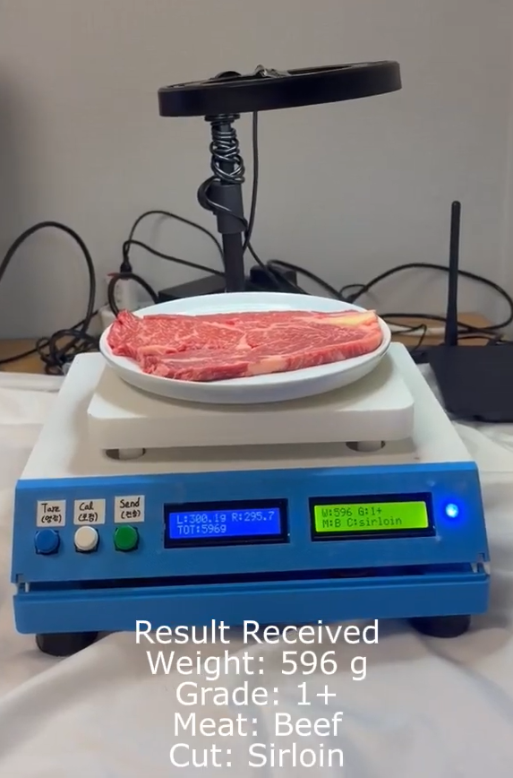
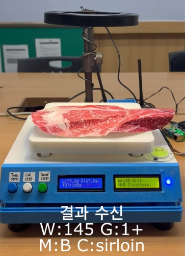
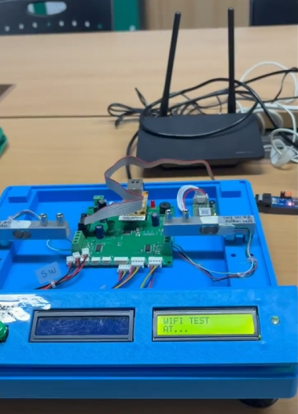
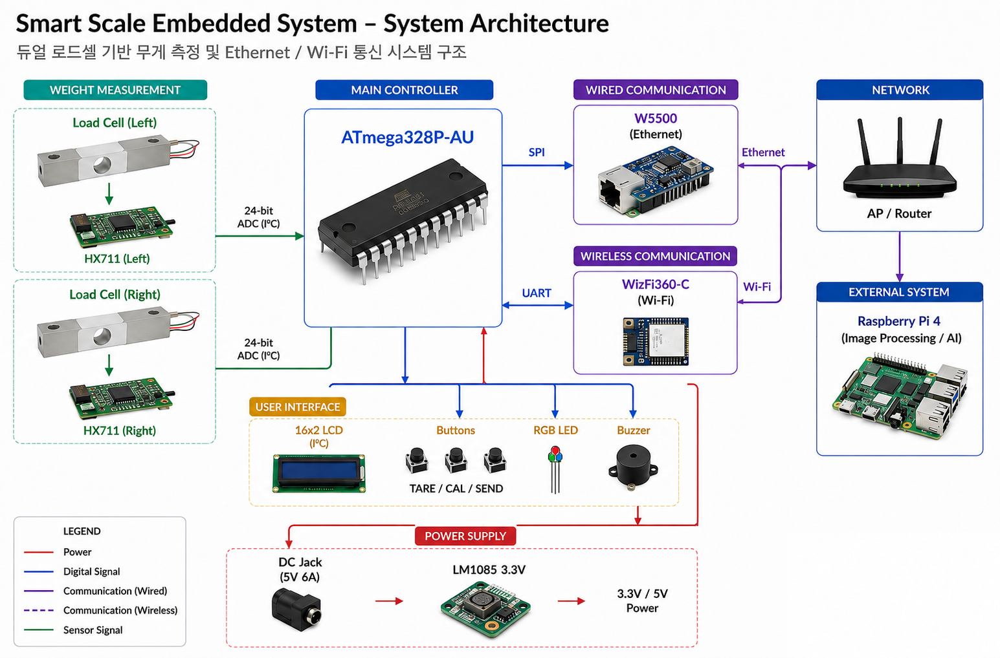
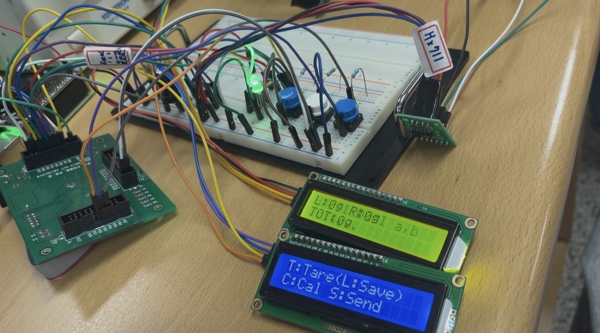
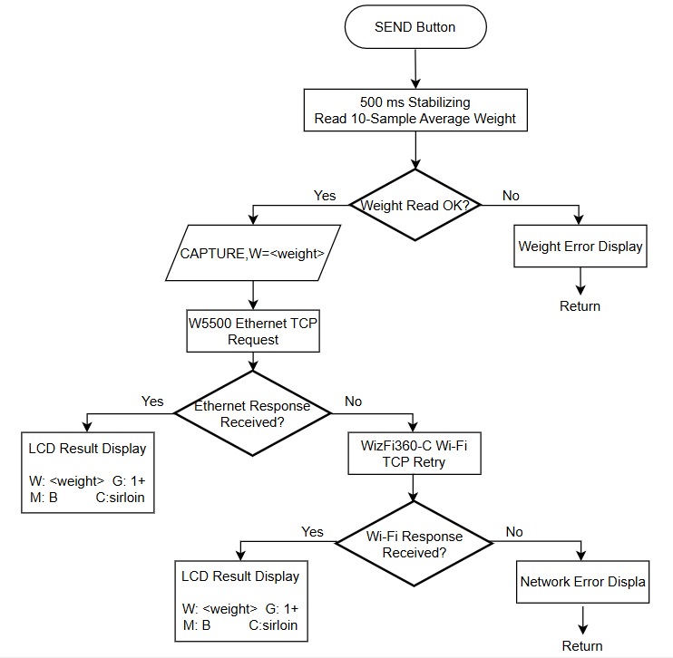
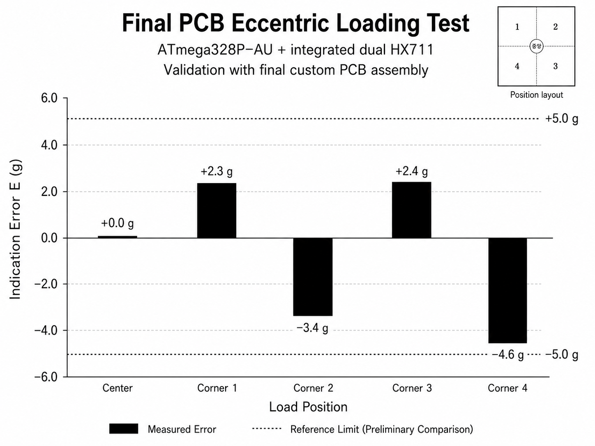
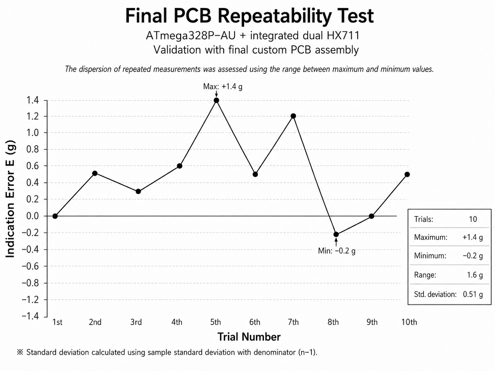
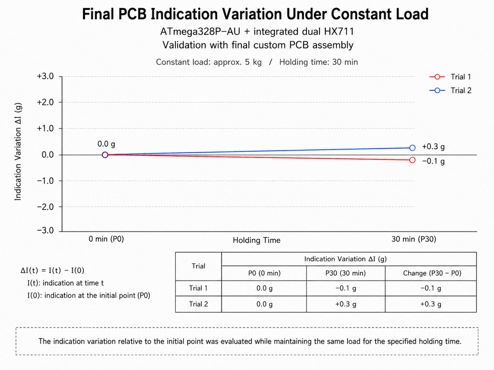

# Smart Scale Embedded System

ATmega328P-AU 기반 Custom PCB와 Dual Load Cell을 이용하여
무게 측정 및 Ethernet/Wi-Fi 통신 기능을 구현한 스마트 전자저울입니다.

로드셀 계측, LCD UI, 사용자 입력, 유·무선 통신 및
Raspberry Pi 외부 처리 시스템 연동을 구현했습니다.

---

## Final Implementation

ATmega328P-AU 기반 Custom PCB, Dual Load Cell, LCD 및
Ethernet/Wi-Fi 통신부를 통합하여 최종 스마트 전자저울 시스템을 구현했습니다.

실제 육류를 이용한 최종 통합 테스트에서 무게 측정부터
외부 처리 시스템으로의 분석 요청 및 결과 수신까지 전체 동작을 확인했습니다.

---

## Key Features

- ATmega328P-AU 기반 2-Layer Custom PCB 설계 및 제작
- Dual Load Cell + Dual HX711 기반 무게 측정
- Tare / Calibration / Auto Zero
- W5500 Ethernet + WizFi360-C Wi-Fi
- Ethernet 실패 시 Wi-Fi 재전송
- Raspberry Pi 외부 시스템 연동

---

## Demo Videos

### 1. Final System Demo with Actual Meat

실제 육류를 이용하여 최종 시스템의 전체 동작 흐름을 검증했습니다.

- Actual meat weighing
- Weight measurement
- Analysis request
- Ethernet / Wi-Fi communication
- External processing
- Result display on LCD

▶ 

### 2. 4-Step Functional Demo

무게 측정부터 데이터 전송 및 분석 결과 수신까지 전체 시스템 동작을 검증했습니다.

- Weight Measurement
- Tare / Auto Zero
- Ethernet Communication
- Wi-Fi Retry
- Result Display

▶ 

### 3. Custom PCB Bring-up & Hardware Verification

Custom PCB 제작 후 주요 하드웨어 기능을 단계별로 검증했습니다.

- Dual HX711 / Load Cell 동작 확인
- LCD / RGB LED / Button / Buzzer 확인
- 실제 하중 측정
- Ethernet / Wi-Fi 통신 모듈 확인

▶ 

---

## System Architecture

Dual Load Cell의 측정값을 ATmega328P-AU에서 처리하고,
W5500 또는 WizFi360-C를 통해 Raspberry Pi 외부 처리 시스템과 데이터를 송수신합니다.

---

## Development & Hardware

### 1. Prototype Validation

최종 PCB 설계 이전에 ATmega128A 기반 제어 환경과 HX711 모듈을 이용하여
Dual Load Cell 계측 구조를 사전 검증했습니다.

Accuracy, Repeatability, Eccentric Loading 및 일정 하중 유지에 따른
표시값 변화 항목을 시제품 수준에서 확인했습니다.

> 해당 결과는 최종 Custom PCB 성능이 아닌 PCB 설계 이전 단계의 사전 검증 결과입니다.

### 2. Custom PCB Development

Prototype에서 검증한 Dual Load Cell 계측 구조를 기반으로 ATmega328P-AU, Dual HX711, 유·무선 통신 및 UI 회로를 하나의 2-Layer Main PCB에 통합했습니다.

| Prototype                  | Final Custom PCB         |
| -------------------------- | ------------------------ |
| ATmega128A 기반 검증 환경        | ATmega328P-AU Custom PCB |
| HX711 Module ×2            | HX711 IC ×2 PCB 통합       |
| Breadboard / Jumper Wiring | 2-Layer PCB Routing      |
| 기능 사전 검증                   | 통합 시스템 구현                |

Detailed schematics are available in [`hardware/schematic`](hardware/schematic).

---

## Firmware Structure

Firmware는 기능별 모듈로 분리하여 구성했습니다.

| Module | Function |
|---|---|
| `Dual_Scale.h`, `Calib.h` | Dual Load Cell 측정 및 Calibration |
| `Tare.h`, `AutoZero.h` | Tare / Auto Zero |
| `LCD.h`, `Button.h` | User Interface |
| `Wiz550.h` | Ethernet |
| `Wizfi360.h` | Wi-Fi |
| `MeatAnalysis.h` | 요청 및 결과 데이터 처리 |

두 로드셀을 독립적으로 측정하고 센서별 Calibration Factor를 적용한 뒤
측정값을 합산하여 최종 무게를 계산합니다.

---

## Ethernet / Wi-Fi Communication

W5500은 SPI 기반 Ethernet 기본 통신 경로로 사용하며, WizFi360-C는 UART 기반 Wi-Fi 보조 경로로 구성했습니다. Ethernet 응답이 정상적으로 수신되지 않을 경우 동일 요청을 Wi-Fi로 재전송합니다.

| 구분                | 데이터 형식                   | 처리                         |
| ----------------- | ------------------------ | -------------------------- |
| Request           | `CAPTURE,W=<weight>`     | 측정 무게와 분석 요청 전송            |
| Ethernet Response | `G`, `M`, `C` 결과 payload | 수신 후 LCD 결과 표시             |
| Wi-Fi Response    | `+IPD,<len>:<payload>`   | AT 응답에서 payload 추출 후 결과 파싱 |

---

## Weight Measurement Validation

최종 Custom PCB와 기구물을 결합한 실제 동작 상태에서 계량 성능을 검증했습니다.

시험 항목은 OIML R 76의 계량 성능 평가 개념을 참고하되,
본 시제품의 검증 목적에 맞춰 일부 항목을 선택하여 구성했습니다.

> 본 실험은 OIML R 76에 따른 공식 적합성 또는 인증 시험이 아닌,
> 시제품의 계량 성능을 확인하기 위한 자체 검증입니다.

| Test | Evaluation |
|---|---|
| Accuracy | 기준 하중 대비 표시 오차 | 
| Eccentric Loading | 동일 하중의 위치 변화에 따른 표시 오차 |
| Repeatability | 동일 하중 반복 측정 시 측정값의 분산 |
| Constant-load Variation | 일정 하중 유지 시 시작점 대비 표시값 변화 |

Accuracy, Eccentric Loading, Repeatability는 다음의 표시 오차를 기준으로 분석했습니다.

`E = I - L`

- `I`: Scale indication
- `L`: Reference load

Constant-load Variation은 시작 시점 대비 표시값 변화량을 사용했습니다.

`ΔI(t) = I(t) - I(0)`

### Result Summary

- **Accuracy:** 하중 증가에 따라 표시 오차가 증가하는 경향을 확인했습니다.

- **Eccentric Loading:** 하중 위치에 따라 최대 약 4.6 g 수준의 위치별 표시 오차가 관찰되었습니다.

- **Repeatability:** 10회 반복 측정을 통해 측정값의 Range와 분산을 확인했습니다.

- **Constant-load Variation:** 약 5 kg을 30분 유지한 결과 시작점 대비 -0.1 g, +0.3 g의 변화가 측정되었습니다.

---

## Troubleshooting

### Dual Load Cell Calibration

**Problem**

좌·우 로드셀 측정값의 편차로 인해 전체 무게값이 안정적으로 유지되지 않는 문제가 발생했습니다.

**Cause**

두 로드셀의 감도 차이와 개별 보정 계수 차이를 확인했습니다.

**Solution**

각 로드셀에 독립적인 보정 계수를 적용한 뒤
두 측정값을 합산하도록 펌웨어를 수정했습니다.

**Result**

좌·우 센서 특성을 개별 보정하여 최종 무게 측정값을 안정화했습니다.

---

## Results

- ATmega328P-AU 기반 Custom PCB 제작 및 Bring-up 완료
- Dual Load Cell 계측과 Ethernet/Wi-Fi failover 동작 검증
- Raspberry Pi 외부 처리 시스템과 연동한 전체 시스템 Demo 완료
